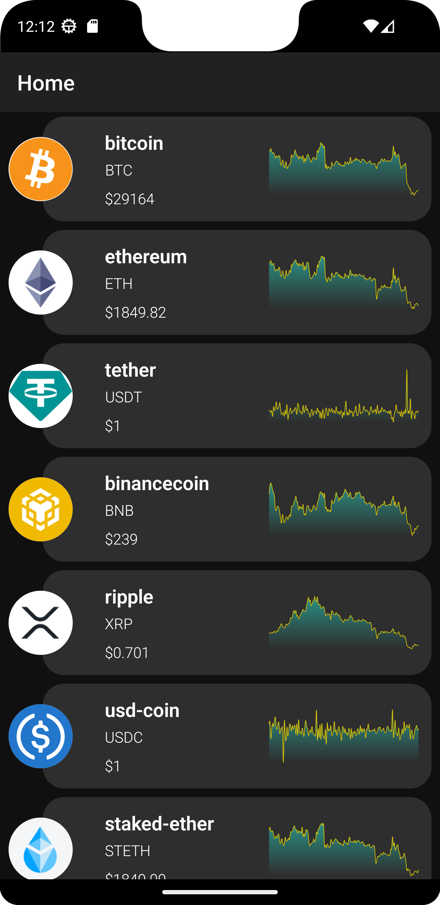
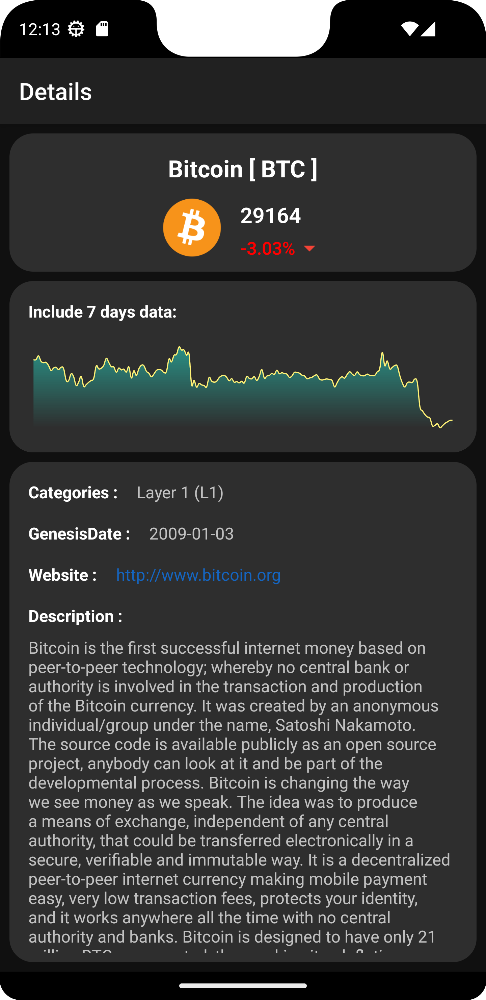

# CryptoCurrency

This application is a cryptocurrency tracking app that lists all the cryptocurrencies in the market and displays the details of each cryptocurrency when a list item is clicked.
***API:***  https://api.coingecko.com/api/v3/

# Libraries Used

+ MVVM Architecture
+ [Hilt](https://developer.android.com/jetpack/compose/libraries#hilt)
+ [Navigation Component](https://developer.android.com/guide/navigation/navigation-getting-started)
+ [ViewModel](https://developer.android.com/topic/libraries/architecture/viewmodel#implement)
+ [Coroutines](https://developer.android.com/kotlin/coroutines)
+ [Flow](https://developer.android.com/kotlin/flow)
+ [Repositories](https://developer.android.com/topic/architecture#data-layer)
+ [LiveData](https://developer.android.com/topic/libraries/architecture/livedata)
+ ***Third party libraries***
  - [Retrofit](https://square.github.io/retrofit/)
  - [OkHttp](https://square.github.io/okhttp/recipes/)
  - [Gson](https://github.com/google/gson)

# Output
| Home Screen | Detail Screen |
| --- | --- | 
|  |  | 
